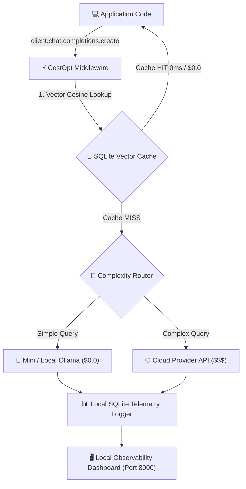

<p align="center">
  <br />
  
  <br />
  <br />
  <p align="center">
    <strong>Drop-in LLM API cost optimization SDK & local developer observability platform.</strong>
    <br />
    Stop paying for redundant LLM calls. Intercept, route, cache, and optimize prompt spend <em>before</em> requests hit paid APIs.
  </p>
</p>

<p align="center">
  <a href="https://github.com/khusshdesai/CostOpt/actions"></a>
# CostOpt — Cost-Aware Local Development & Feature-Level LLM Cost Attribution ⚡

[](https://pypi.org/project/costopt/)
[](https://opensource.org/licenses/MIT)
[](https://github.com/khusshdesai/CostOpt/actions/workflows/ci.yml)
[](https://www.python.org/downloads/)

> **Don't wait for a $500 monthly cloud bill to figure out where your LLM budget went.**
> **CostOpt puts real-time cost attribution directly into your local development loop—giving you feature-level spend visibility, lexical response caching, and automated optimization recommendations before code ships.**

---

### 💡 Why CostOpt?

Most LLM gateways operate in **production infrastructure** *after* code is shipped. CostOpt operates in your **local development loop**:

1. **Feature-Level Cost Attribution**: Group LLM calls by feature or component (`feature="rag_summarizer"`) to track feature unit economics before shipping.
2. **Local Lexical Cache**: High-speed token & n-gram similarity cache returning **sub-2ms latency and $0.00 cost** on repeated prompts.
3. **Automated Archaeological Recommendations**: Auto-detects cache under-utilization and model reroute opportunities directly from your usage patterns.
4. **Zero-Churn 1-Line SDK Interception**: Patches standard OpenAI client calls with zero architectural refactoring.

---

## 🖥️ Developer Observability Console

<p align="center">
  
</p>

<p align="center">
  <em>Live System Overview displaying spend metrics, vector cache hits, optimization recommendations, and prompt interception logs.</em>
</p>

<br />

<p align="center">
  
</p>

<p align="center">
  <em>Dedicated Trace Explorer auditing prompt MD5 hashes, response latencies, model rerouting decisions, and status code badges.</em>
</p>

## 🏗️ Architecture & Request Flow



---

## 🚀 Quickstart

### 1. Installation

```bash
pip install costopt
```

### 2. Basic Integration

```python
from openai import OpenAI
from costopt import CostOpt

# Wrap standard client in one line
client = CostOpt(OpenAI(api_key="your-api-key"))

# Requests are automatically intercepted, cached, and optimized!
response = client.chat.completions.create(
    model="gpt-4o",
    messages=[{"role": "user", "content": "Classify sentiment: I love python!"}]
)
```

### 3. Launch Observability Dashboard

```bash
costopt dashboard
```

Open **`http://localhost:8000`** in your browser to view real-time spend analytics, trace logs, and policy rules!

### 4. Integration with Popular Frameworks

CostOpt wraps standard OpenAI-compatible client instances in 1 line:

**LangChain**:
```python
from langchain_openai import ChatOpenAI
from costopt import CostOpt

# Wrap underlying client
llm = ChatOpenAI(client=CostOpt(OpenAI()).client)
```

**LlamaIndex**:
```python
from llama_index.llms.openai import OpenAI as LlamaOpenAI
from costopt import CostOpt

llm = LlamaOpenAI(client=CostOpt(OpenAI()).client)
```

**FastAPI Middleware Integration**:
```python
from fastapi import FastAPI
from openai import OpenAI
from costopt import CostOpt

app = FastAPI()
ai_client = CostOpt(OpenAI())
```

---

## 🔧 Configuration Guide

### Custom Models & User Local Overrides

Track custom, fine-tuned, or local models by dropping a `.yaml` file into your project:

```yaml
provider: "ollama"
models:
  deepseek-r1:
    input_cost_per_1m: 0.0
    output_cost_per_1m: 0.0
```

Pass the pricing directory:

```python
client = CostOpt(OpenAI(), pricing_dir="./my_pricing")
```

---

## 🛡️ Security Audit

CostOpt has undergone automated penetration testing for SQL injections, CORS misconfigurations, and rate-limiting DB locks. See the full audit report at [`docs/SECURITY_AUDIT.md`](docs/SECURITY_AUDIT.md).

---

## 📄 License

This project is licensed under the MIT License. See [LICENSE](LICENSE) for details.
