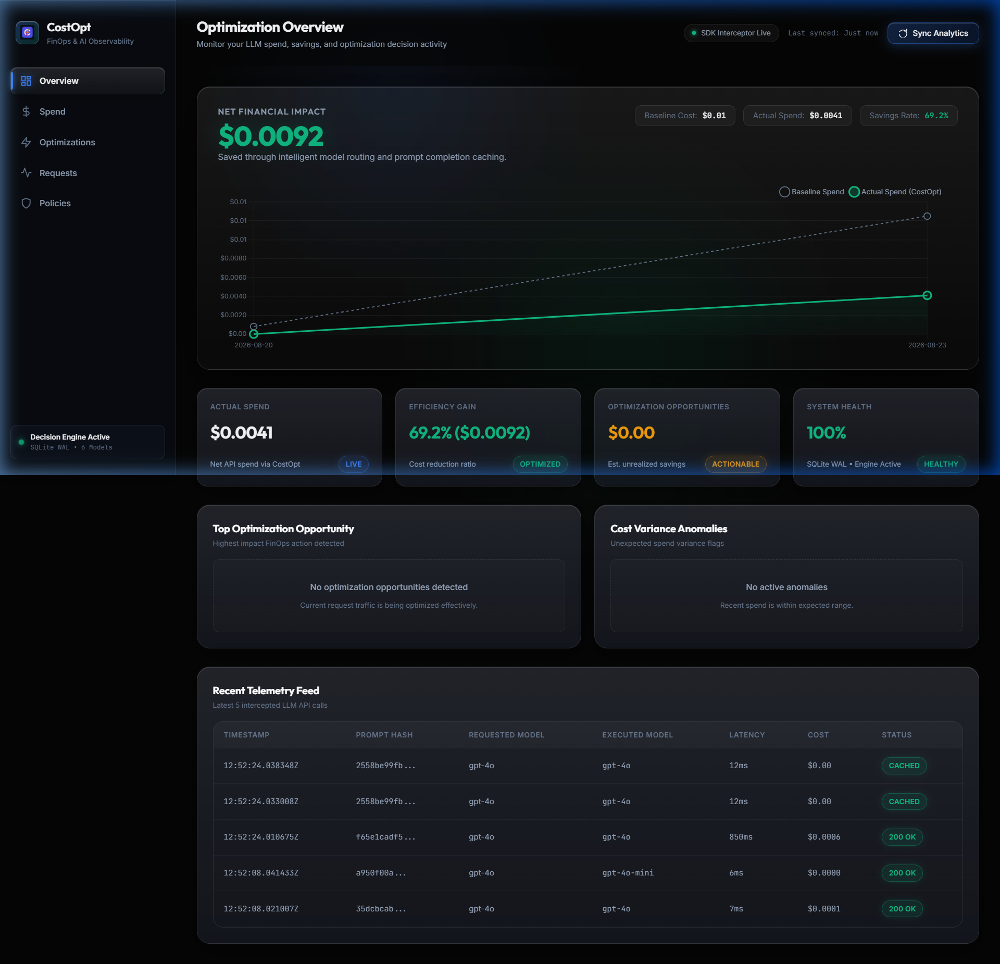
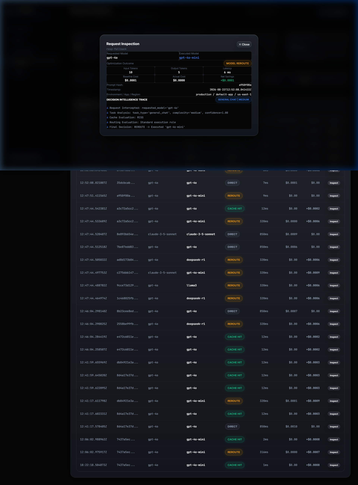

# CostOpt — Developer-Focused LLM Cost Optimization & Observability Platform

[](https://www.python.org/)
[](LICENSE)
[](tests/)

CostOpt is an open-source, local-first LLM cost optimization SDK and observability console. It intercepts OpenAI and compatible ChatCompletion API calls to reduce LLM spend through multi-tier prompt caching, intelligent model rerouting, and real-time FinOps telemetry without adding cloud infrastructure or external database dependencies.

---

## Overview

### The Problem
Generative AI applications frequently overspend by:
1. **Executing Duplicate Requests**: Re-querying upstream APIs for exact or near-identical prompts.
2. **Over-provisioning Models**: Routing simple classification, extraction, or short summarization queries to expensive flagship models (e.g., `gpt-4o`, `claude-3-5-sonnet`) when lower-cost models (`gpt-4o-mini`, `claude-3-haiku`, `llama3`) satisfy accuracy requirements.
3. **Lack of Cost Visibility**: Difficulty tracking net savings, model breakdown, or request-level optimization decisions.

### The CostOpt Solution
CostOpt acts as a transparent, drop-in SDK interceptor and decision engine that:
- Serves prompt hits locally in **<15ms at $0.00 cost** via an SQLite prompt cache.
- Analyzes request complexity to automatically route simple tasks to cost-effective models.
- Enforces quality guardrails and automatic outage failovers.
- Records unified FinOps telemetry displayed on a dark-slate dashboard.

---

## Key Capabilities

- **Exact MD5 Prompt Cache**: Replays exact prompt completions locally with parameter hashing (`temperature`, `tools`, `response_format`, `max_tokens`, `seed`).
- **Local TF-IDF Similarity Cache**: Computes word and character n-gram cosine vector similarity for prompt variants.
- **Request Intent Analysis**: Classifies incoming prompts into 7 task types (`simple_classification`, `extraction`, `summarization`, `coding`, `reasoning`, `creative_generation`, `general_chat`) with confidence scoring.
- **Model Capability Registry**: Centralized registry containing capability scores (0–100), task suitabilities, and token pricing for OpenAI, Anthropic, Google, and Ollama models.
- **Policy-Aware Rerouting**: Evaluates `costopt.yaml` rules to route eligible queries from flagship models to efficient alternatives.
- **Safety & Quality Guardrails**: Preserves original flagship models for high-complexity coding/reasoning prompts or low confidence scores (<0.70).
- **Circuit Breaker & Outage Failover**: Detects call velocity loops and automatically fails over to active backups during upstream 429/500 API outages.
- **Decision Trace Explainability**: Stores human-readable step-by-step decision traces with every transaction.
- **FinOps Observability Dashboard**: Built-in 5-view web console (`Overview`, `Spend`, `Optimizations`, `Requests`, `Policies`).

---

## Architecture

```mermaid
flowchart TD
    App[Calling Application] -->|ChatCompletion.create| Interceptor[CostOpt SDK Client Interceptor]
    Interceptor --> CB[Circuit Breaker Check]
    CB --> Engine[Centralized Decision Engine]
    
    subgraph Engine [Intelligent Decision Pipeline]
        Analyzer[1. Request Analyzer\nTask & Complexity Classification]
        CacheLayer[2. Semantic Cache Layer\nTier 1: MD5 Exact | Tier 2: TF-IDF Cosine]
        Registry[3. Model Capability Registry\nCapability Scores & Token Pricing]
        Guardrails[4. Fallback & Quality Guardrails\nConfidence & Outage Failover]
        Estimator[5. Cost Estimator\nBaseline vs Target Cost Delta]
    end
    
    CacheLayer -->|Cache HIT <15ms| Hit[Return Local Response $0.00]
    CacheLayer -->|Cache MISS| Registry
    Registry --> Guardrails
    Guardrails -->|Decision: REROUTE / DIRECT| API[Upstream LLM API]
    API -->|Outage 429/500| Failover[Failover Secondary Model]
    
    Hit --> DB[(SQLite Telemetry & Cache DB)]
    API --> DB
    Failover --> DB
    
    DB --> Dashboard[CostOpt FinOps Dashboard\nhttp://127.0.0.1:8000]
```

---

## Optimization Decision Flow

Every request is evaluated by the centralized `DecisionEngine` and assigned one of four execution outcomes:

| Decision | Condition | Execution Path |
| :--- | :--- | :--- |
| **`CACHE`** | Prompt matches an existing exact or semantic entry in `costopt_cache.db`. | Returned locally in <15ms ($0.00 cost). |
| **`REROUTE`** | Cache miss; task is low/medium complexity, confidence >= 0.70, and a cheaper capable model exists. | Routed to cost-effective target model (e.g., `gpt-4o` ➔ `gpt-4o-mini`). |
| **`DIRECT`** | Cache miss; high-complexity reasoning/coding task or low confidence (<0.70). | Executed using original requested model for maximum accuracy. |
| **`FALLBACK`** | Primary model endpoint fails or circuit breaker indicates outage. | Auto-failed over to secondary fallback model. |

---

## Dashboard

The built-in web console operates on `http://127.0.0.1:8000`, featuring a **Zenix Refined Glass** visual theme (`#050505` canvas, 35px backdrop blur, translucent borders, ambient glows, fixed left sidebar shell, and bento grid layout) across 5 primary navigation tabs:



1. **Overview**: Net Financial Impact Hero Glass Card (`$0.0023` / dynamic savings), smooth Chart.js spend trend area chart, bento metrics grid (Actual Spend, Efficiency Gain, Opportunities, System Health), top recommendation card, and live telemetry feed.
2. **Spend**: Actual LLM spend hero card with baseline comparison, spend by model/provider bento distribution cards, and sortable model cost breakdown table.
3. **Optimizations**: Dominant Net Savings hero card, Decision Strategy distribution (`Cache Hits`, `Model Reroutes`, `Direct Execution`), Task Classification breakdown, active optimization engines status cards, and real-time audit activity log.
4. **Requests**: Request explorer table with prompt search, outcome filter badges (`CACHE HIT`, `REROUTE`, `DIRECT`), and **Request Inspection Drawer (`#global-modal`)** displaying step-by-step **Decision Intelligence Traces**.



5. **Policies**: Active policy rules visual cards (`Requested Model ➔ Target Model`), model routing map, live `costopt.yaml` policy editor with unsaved state detection, save/revert options, and destructive cache/telemetry management.

---

## Project Structure

```
.
├── src/costopt/
│   ├── __init__.py           # SDK package exports
│   ├── client.py             # CostOpt SDK Client Interceptor
│   ├── cache.py              # SQLite cache engine (MD5 + TF-IDF Cosine)
│   ├── router.py             # YAML rule matching & fallbacks
│   ├── pricing.py            # Token pricing loader & cost calculation
│   ├── telemetry.py          # Async SQLite telemetry logger
│   ├── circuit_breaker.py    # Rate-limiting & loop detection
│   ├── anomaly.py            # Z-score statistical cost anomaly detector
│   ├── main.py               # CLI entrypoint (costopt dashboard)
│   ├── optimization/         # Phase 3 Intelligent Optimization Engine
│   │   ├── analyzer.py       # Request intent & complexity analyzer
│   │   ├── model_registry.py # Model capability registry & metadata
│   │   ├── semantic_cache.py # Multi-tier cache layer
│   │   ├── cost_estimator.py # Cost & savings calculator
│   │   ├── fallback_manager.py # Quality guardrails & outage failover
│   │   └── decision_engine.py  # Centralized decision orchestrator
│   └── api/                  # FastAPI Web Backend
│       ├── server.py         # FastAPI application init
│       └── routes.py         # Dashboard API endpoints
├── dashboard/                # Frontend Web Console
│   ├── index.html            # Single Page App DOM layout
│   ├── style.css             # Enterprise FinOps theme (Dark Slate)
│   └── app.js                # Tab routing, Chart.js, & modal handlers
├── pricing/providers/        # Token pricing YAML manifests
│   ├── openai.yaml
│   ├── anthropic.yaml
│   ├── google.yaml
│   ├── huggingface.yaml
│   └── ollama.yaml
├── tests/                    # Pytest test suite
│   ├── unit/                 # Unit & integration tests
├── costopt.yaml              # Active policy configuration file
├── pyproject.toml            # Python packaging metadata
├── requirements.txt          # Python dependencies manifest
└── README.md                 # Project documentation
```

---

## Installation

### Prerequisites
- Python 3.10 or higher

### Step-by-Step Setup

1. **Clone the Repository**:
   ```bash
   git clone https://github.com/khusshdesai/CostOpt.git
   cd CostOpt
   ```

2. **Create and Activate Virtual Environment**:
   ```bash
   python -m venv venv
   # On Windows:
   venv\Scripts\activate
   # On macOS/Linux:
   source venv/bin/activate
   ```

3. **Install Dependencies**:
   ```bash
   pip install -r requirements.txt
   # Or install in editable development mode:
   pip install -e .
   ```

4. **Configure Environment Variables**:
   ```bash
   cp .env.example .env
   ```

---

## Usage

### 1. SDK Python Interceptor Example

Wrap your existing `openai.OpenAI()` client with `CostOpt`:

```python
from openai import OpenAI
from costopt import CostOpt

# Initialize original client
raw_client = OpenAI(api_key="your-api-key")

# Wrap client with CostOpt Interceptor
client = CostOpt(
    client=raw_client,
    provider="openai",
    config_path="costopt.yaml",
    environment="production"
)

# Call completions as normal — CostOpt automatically analyzes, caches, and routes queries
response = client.chat.completions.create(
    model="gpt-4o",
    messages=[
        {"role": "system", "content": "You are a sentiment analyzer."},
        {"role": "user", "content": "Classify sentiment: This product is outstanding!"}
    ]
)

print(response.choices[0].message.content)
```

### 2. Starting the Dashboard Console

Launch the web console using the CLI:

```bash
costopt dashboard
# Or run via Python module:
python -m costopt.main dashboard
```

Open `http://127.0.0.1:8000` in your web browser.

---

## Configuration

Control model routing policies and fallback chains in `costopt.yaml`:

```yaml
routing:
  rules:
    - name: "Simple text classification"
      keywords: ["classify", "sentiment", "yes/no", "label"]
      max_prompt_length: 500
      original_model: "gpt-4o"
      target_model: "gpt-4o-mini"

  fallbacks:
    gpt-4o:
      - "claude-3-5-sonnet"
      - "gpt-4o-mini"
```

---

## Testing

Run the automated Pytest test suite:

```bash
python -m pytest tests/ -v
```

**Test Status**: All 18 test cases pass cleanly (100% pass rate).

---

## Limitations

- **Local Similarity Caching**: The semantic cache uses TF-IDF word and character n-gram cosine vector similarity matching locally. It does not require or connect to external cloud vector databases (e.g., Pinecone, Weaviate).
- **Single-Node SQLite Architecture**: Designed for local development, single-instance microservices, or sidecar proxies.
- **Heuristic Capability Scores**: Model capability scores (0–100) are curated in `ModelRegistry` and can be adjusted as new model benchmarks are published.

---

## Future Possibilities

- Embedding-based semantic caching via local ONNX runtime embeddings.
- Native SDK wrappers for LangChain and LlamaIndex.
- Distributed Redis caching adapter for multi-node deployments.

---

## License

This project is licensed under the [MIT License](LICENSE).
