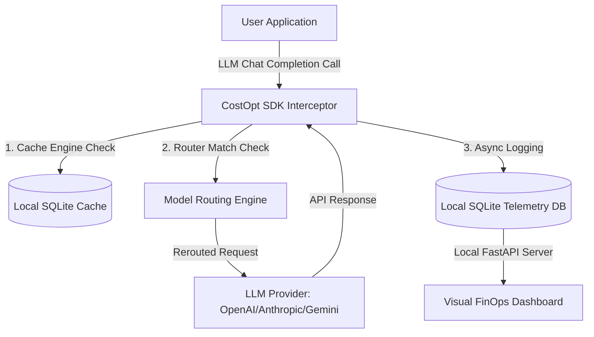

# CostOpt

<p align="center">
  <a href="https://github.com/khusshdesai/CostOpt/actions"></a>
  <a href="https://github.com/khusshdesai/CostOpt/blob/main/LICENSE"></a>
  <a href="https://pypi.org/project/costopt/"></a>
  <a href="https://github.com/psf/black"></a>
</p>

LLM CostOpt is an open-source, lightweight **developer SDK and local observability platform** designed to intercept provider-agnostic LLM calls, execute real-time cost-saving optimizations (caching, routing, failover fallbacks), and log metrics to a local SQLite store for interactive visualization.

Unlike traditional cost platforms that merely audit spend *after* the fact, LLM CostOpt prevents waste *before* requests hit external APIs.

---

## 🚀 Key Features

- **One-Line SDK Integration**: Drop-in wrapper patches standard clients (`openai.OpenAI`, etc.) with zero modification of calling code.
- **Dynamic Cost-Driven Routing**: Automatically detects low-complexity intent and redirects requests to cheaper models (e.g. `gpt-4o` -> `gpt-4o-mini`).
- **Fuzzy Token Caching**: SQLite-backed local cache featuring exact string MD5 lookup and fuzzy token Jaccard-distance similarity to catch minor prompt variations (trailing periods, whitespaces, etc.) without heavy vector DB configurations.
- **Failover Backup Routing**: Resilient failover logic automatically redirects traffic to a backup model chain if the primary API fails (e.g. rate-limits or 503 errors).
- **100% Private & Infrastructure Free**: Runs locally in the application process and logs to SQLite. No Docker, Next.js, or external database required to get started.

---

## ⚙️ Architecture



---

## 📦 Tech Stack

- **Interception**: Python 3.10+, Standard Library delegation wrapper.
- **Caching & Telemetry**: SQLite3 (Indexed prompt hashes & timestamps).
- **Configuration & Pricing**: YAML parsing with `PyYAML`.
- **API Server**: FastAPI + Uvicorn.
- **Dashboard Interface**: Glassmorphic HTML5 + CSS3 + Chart.js (Zero node_modules/JS framework overhead).

---

## ⚡ Quickstart

### 1. Installation
Install the package in editable development mode:
```bash
pip install -e .
```

### 2. Integration
Wrap your standard OpenAI client. LLM CostOpt handles everything else transparently:

```python
import openai
from costopt import CostOpt

# Instantiate standard client
base_client = openai.OpenAI(api_key="your_api_key")

# Wrap it with CostOpt
client = CostOpt(
    client=base_client,
    config_path="costopt.yaml",
    cache_db_path="costopt_cache.db",
    telemetry_db_path="costopt_telemetry.db",
    environment="production",
    application="customer-facing-chat"
)

# Use exactly as before - completions are cached and routed automatically!
response = client.chat.completions.create(
    model="gpt-4o",
    messages=[{"role": "user", "content": "Please classify this feedback: Positive!"}]
)

print(response.choices[0].message.content)

# Gracefully flush background telemetry thread on exit
client.shutdown()
```

---

## 📊 Run the Local Developer Dashboard

LLM CostOpt includes a built-in interactive control center.

### 1. Generate Synthetic Simulation Data (Optional)
To test the visual dashboard with realistic telemetry data (cost anomalies, caching statistics, and routing logs) without spending real API credits, run:
```bash
costopt generate-data --records 1000 --days 30
```

### 2. Start the Web Server
Launch the FastAPI server and view the dashboard:
```bash
costopt dashboard
```
Open **`http://127.0.0.1:8000`** in your browser to view the premium dashboard.

---

## 🔧 Configuration Guide

### `costopt.yaml` (Routing Policies)
Set up conditions to redirect complex queries to cost-effective mini models:

```yaml
routing:
  rules:
    - name: "Simple text classification"
      keywords: ["classify", "yes/no", "sentiment", "label", "extract"]
      max_prompt_length: 500
      original_model: "gpt-4o"
      target_model: "gpt-4o-mini"
  fallbacks:
    gpt-4o: ["claude-3-5-sonnet", "gpt-4o-mini"]
```

---

## 🧩 Extending LLM CostOpt (Contribution Hooks)

LLM CostOpt is built with plugin architecture. You can easily extend the platform by inheriting from these Base Classes:

1. **`BaseProvider`**: Exposes calculation and parse hooks to support new engines (Ollama, local vLLM).
2. **`BaseRoutingStrategy`**: Write custom complexity routers or classification logic.
3. **`BaseCache`**: Decouple cache from SQLite (e.g. write a `RedisCache` or `QdrantSemanticCache`).
4. **`BaseTelemetryExporter`**: Send logs to OpenTelemetry, Datadog, or Snowflake.

See our design specifications at [`oss_contribution_architecture.md`](file:///c:/Users/Lenovo/Downloads/DS%20mini%20project/oss_contribution_architecture.md).

---

## 🗄️ Telemetry Database Schema

Logs are stored in the local SQLite table `telemetry` with the following schema structure:

| Column | Type | Description |
| :--- | :--- | :--- |
| `timestamp` | TEXT | Timestamp when the request completed. |
| `request_id` | TEXT | Unique request UUID. |
| `provider` | TEXT | Hosting provider (e.g. `openai`). |
| `model_requested` | TEXT | Original target model model (e.g. `gpt-4o`). |
| `model_used` | TEXT | Actual executed model (e.g. `gpt-4o-mini`). |
| `input_tokens` | INTEGER | Prompt input token count. |
| `output_tokens` | INTEGER | Completion output token count. |
| `latency_ms` | INTEGER | Request latency. |
| `status_code` | INTEGER | HTTP status code. |
| `success` | BOOLEAN | Success flag. |
| `error_type` | TEXT | Captured error name. |
| `cache_hit` | BOOLEAN | True if cached locally. |
| `cost_original` | REAL | original cost in USD of requested model. |
| `cost_actual` | REAL | actual spend in USD. |
| `savings` | REAL | Cost reduction amount in USD. |
| `prompt_hash` | TEXT | MD5 identifier of prompt text. |
| `environment` | TEXT | Application deployment stage (`production`, `staging`, `dev`). |
| `application` | TEXT | Service name wrapper. |
| `region` | TEXT | Regional identifier. |
| `retry_count` | INTEGER | Number of retry runs triggered. |

---

## 🧪 Testing

To run the local automated test suite:
```bash
$env:PYTHONPATH="src"
python -m pytest tests/unit/test_costopt.py
```

---

## 🛡️ Security Audit
CostOpt has undergone automated penetration testing for SQL injections, CORS misconfigurations, and rate-limiting DB locks. See the full audit report at [`docs/SECURITY_AUDIT.md`](docs/SECURITY_AUDIT.md).

---

## 📄 License
This project is licensed under the MIT License. See [LICENSE](LICENSE) for details.
