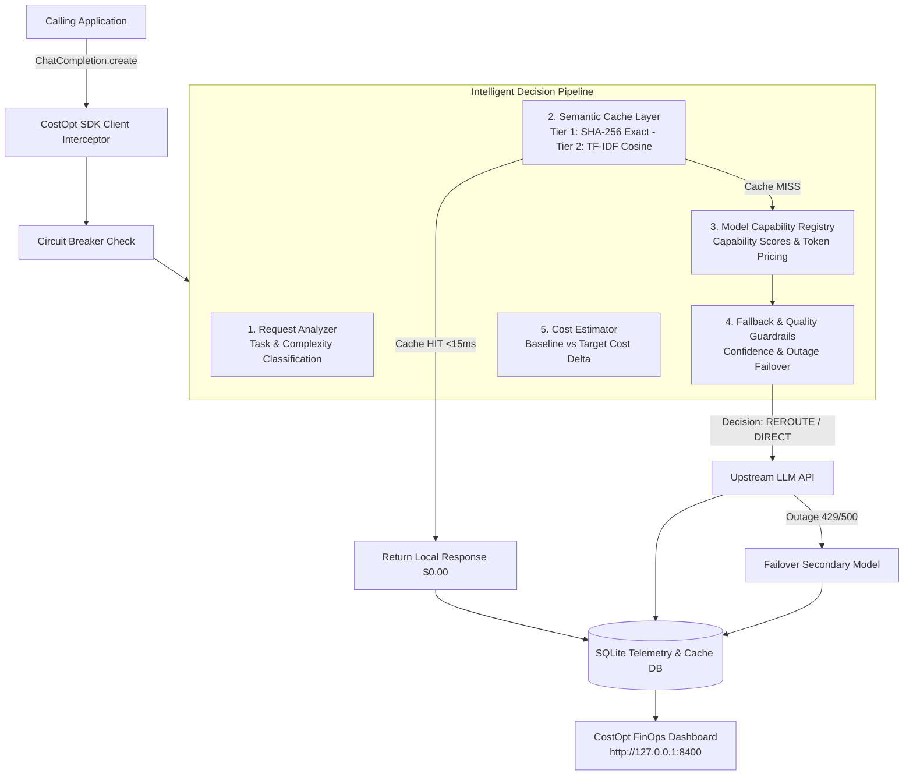

<p align="center">
  
</p>

<h1 align="center">CostOpt — Developer-Native LLM Cost Intelligence ⚡</h1>

<p align="center">
  <strong>Drop-in wrapper for OpenAI, Anthropic & Gemini clients that adds automatic caching, smart model routing, circuit breaker protection, and a real-time observability dashboard — all 100% local.</strong><br>
  <em>Stop waiting for a $500 monthly cloud bill to figure out where your LLM budget went.</em>
</p>

<p align="center">
  <a href="https://pypi.org/project/costopt/"></a>
  <a href="https://pypi.org/project/costopt/"></a>
  <a href="https://open-vsx.org/extension/khusshdesai/costopt-vscode"></a>
  <a href="https://marketplace.visualstudio.com/items?itemName=khusshdesai.costopt-vscode"></a>
  <a href="https://github.com/khusshdesai/CostOpt/blob/main/LICENSE"></a>
  <a href="https://www.python.org/"></a>
  <a href="https://marketplace.visualstudio.com/items?itemName=khusshdesai.costopt-vscode"></a>
</p>

---

## ⚡ Overview

### The Problem
Generative AI applications frequently overspend by:
1. **Executing Duplicate Requests**: Re-querying upstream APIs for exact or near-identical prompts.
2. **Over-provisioning Models**: Routing simple classification, extraction, or short summarization queries to expensive flagship models (e.g., `gpt-4o`, `claude-3-5-sonnet`) when lower-cost models (`gpt-4o-mini`, `claude-3-haiku`, `llama3`, `deepseek-r1`) satisfy accuracy requirements.
3. **Lack of Cost Visibility**: Difficulty tracking net savings, model breakdown, or request-level optimization decisions.

### The CostOpt Solution
CostOpt acts as a transparent, drop-in SDK interceptor and decision engine that:
- Serves prompt hits locally in **<15ms at $0.00 cost** via an SQLite prompt cache.
- Analyzes request intent and complexity to automatically route simple tasks to cost-effective models.
- Enforces quality guardrails and automatic outage failovers.
- Records unified FinOps telemetry displayed on a real-time web console.

---

## 🔌 1-Line Zero-Churn Integration

```python
# ─── BEFORE (Standard OpenAI Client) ────────────────────────────────────────
from openai import OpenAI
client = OpenAI()

# ─── AFTER (With CostOpt — zero other changes needed) ───────────────────────
from openai import OpenAI
from costopt import CostOpt

client = CostOpt(OpenAI())  # 👈 Intercepts transparently

# Your API calls are 100% identical — CostOpt automatically analyzes, caches, & routes:
response = client.chat.completions.create(
    model="gpt-4o",
    messages=[{"role": "user", "content": "Classify customer feedback: Great product!"}]
)
print(response.choices[0].message.content)
```

---

## ⚡ Core Features

| Feature | Description |
|---|---|
| 🗄️ **Multi-Tier Prompt Cache** | Tier 1 exact SHA-256 hash matching (<15ms, $0.00) + Tier 2 local TF-IDF cosine vector similarity matching. Includes parameter hashing (`temperature`, `tools`, `response_format`, `seed`). |
| 🧠 **Intelligent Decision Engine** | Classifies prompts into 7 task categories (`simple_classification`, `extraction`, `summarization`, `coding`, `reasoning`, `creative_generation`, `general_chat`) with confidence scoring. |
| 🔀 **Policy-Aware Model Router** | Rule-based keyword and task-complexity routing — simple tasks auto-rerouted to efficient models (`gpt-4o` ➔ `gpt-4o-mini` / `deepseek-r1`). |
| 🛡️ **Circuit Breaker** | Detects call velocity loops from the same file/line location and trips `CostOptCircuitBreakerError`. |
| 🔄 **Outage Failover** | Auto-retries fallback models on 429/503 errors (`gpt-4o` ➔ `claude-3-5-sonnet` ➔ `llama3`). |
| 📊 **Observability & FinOps Console** | Premium dark-mode dashboard (`#050505` canvas, fixed left sidebar, bento grid layout) for Overview, Spend, Optimizations, Requests, and Policies. |
| 🔍 **Decision Intelligence Traces** | Step-by-step visual trace flow explaining every request analysis, cache evaluation, and routing decision. |
| 🖥️ **VS Code Extension** | Inline CodeLens cost per request, call counts, hover panels, and status bar metrics directly inside VS Code. |
| 🔒 **100% Local & Private** | Stored in local SQLite (`costopt_telemetry.db`, `costopt_cache.db`). Zero data leaves your machine. |

---

## 🏗️ Architecture



---

## 🚦 Optimization Decision Flow

Every request is evaluated by the centralized `DecisionEngine` and assigned one of four execution outcomes:

| Decision | Condition | Execution Path |
| :--- | :--- | :--- |
| **`CACHE`** | Prompt matches an existing exact or semantic entry in `costopt_cache.db`. | Returned locally in <15ms ($0.00 cost). |
| **`REROUTE`** | Cache miss; task is low/medium complexity, confidence >= 0.70, and a cheaper capable model exists. | Routed to cost-effective target model (e.g., `gpt-4o` ➔ `gpt-4o-mini`). |
| **`DIRECT`** | Cache miss; high-complexity reasoning/coding task or low confidence (<0.70). | Executed using original requested model for maximum accuracy. |
| **`FALLBACK`** | Primary model endpoint fails or circuit breaker indicates outage. | Auto-failed over to secondary fallback model. |

---

## 🚀 Quickstart Guide

### Step 1 — Install Python SDK
```bash
pip install costopt
```

### Step 2 — Wrap your LLM client
```python
from openai import OpenAI
from costopt import CostOpt

client = CostOpt(OpenAI())

response = client.chat.completions.create(
    model="gpt-4o",
    messages=[{"role": "user", "content": "Classify sentiment: This product is outstanding!"}]
)
print(response.choices[0].message.content)
```

### Step 3 — Launch the Observability Dashboard
```bash
costopt dashboard
# Or run via Python module:
python -m costopt.main dashboard
```
Open **[http://127.0.0.1:8400](http://127.0.0.1:8400)** in your browser.

---

## 📊 Observability Dashboard

The web console features a modern dark-mode aesthetic (`#050505` canvas, translucent borders, ambient glows, fixed left sidebar shell, and bento grid layout) across 5 primary navigation tabs:

### 1. Overview
<p align="center">
  
</p>

> Net Financial Impact Hero Glass Card (`$0.0093` / dynamic savings), smooth spend trend area chart, bento metrics grid (Actual Spend, Efficiency Gain, Opportunities, System Health), top recommendation card, and live telemetry feed.

### 2. Spend Analytics
<p align="center">
  
</p>

> Actual LLM spend hero card with baseline comparison, spend by model/provider bento distribution cards, and sortable model cost breakdown table.

### 3. Optimizations Engine
<p align="center">
  
</p>

> Active optimization strategy status cards (Local SQLite Cache, Rule-Based Model Rerouting), total net savings per strategy, and real-time optimization decision activity log.

### 4. Requests Explorer & Decision Intelligence Trace
<p align="center">
  
</p>

> Request explorer transaction log table with prompt search, outcome filter badges (`CACHE HIT`, `REROUTE`, `DIRECT`), and **Request Inspection Drawer** displaying step-by-step **Decision Intelligence Traces**.

### 5. Policies Configuration
<p align="center">
  
</p>

> Active policy rules visual cards (`Requested Model ➔ Target Model`), model routing map, live `costopt.yaml` policy editor with unsaved state detection, save/revert options, and cache/telemetry management.

---

## 🌐 Multi-Provider Support

CostOpt supports wrapping **OpenAI**, **Anthropic**, and **Google Gemini** clients:

```python
# OpenAI
from openai import OpenAI
from costopt import CostOpt

client = CostOpt(OpenAI(), provider="openai")

# Anthropic
import anthropic
from costopt import CostOpt

client = CostOpt(anthropic.Anthropic(), provider="anthropic")

# Google Gemini (via OpenAI-compatible API)
from openai import OpenAI
from costopt import CostOpt

client = CostOpt(
    OpenAI(api_key="...", base_url="https://generativelanguage.googleapis.com/v1beta/openai/"),
    provider="google"
)
```

Supported pricing catalogs: **OpenAI**, **Anthropic**, **Google Gemini**, **HuggingFace**, **Ollama** (local, $0.00).

---

## 📦 Integration with Popular Frameworks

**LangChain:**
```python
from langchain_openai import ChatOpenAI
from costopt import CostOpt
from openai import OpenAI

llm = ChatOpenAI(client=CostOpt(OpenAI()).client)
```

**LlamaIndex:**
```python
from llama_index.llms.openai import OpenAI as LlamaOpenAI
from costopt import CostOpt
from openai import OpenAI

llm = LlamaOpenAI(client=CostOpt(OpenAI()).client)
```

**FastAPI:**
```python
from fastapi import FastAPI
from openai import OpenAI
from costopt import CostOpt

app = FastAPI()
ai_client = CostOpt(OpenAI())
```

---

## 🔧 Configuration Guide (`costopt.yaml`)

CostOpt reads a `costopt.yaml` file from your working directory at startup. If no file is found, a commented template is auto-generated for you.

The config has **two jobs**:
1. **Routing Rules** — fire _before_ the API call to proactively reroute to a cheaper model
2. **Fallback Chains** — fire _after_ an API failure to automatically retry on a different model

---

### Full Config Structure

```yaml
routing:
  fallbacks:
    <your-primary-model>:
      - <fallback-model-1>
      - <fallback-model-2>

  rules:
    - name: "Human-readable label shown in dashboard"
      keywords: ["word1", "word2"]   # trigger if ANY keyword found in prompt
      max_prompt_length: 500         # only trigger for short prompts (chars)
      original_model: "gpt-4o"      # only apply if THIS model was requested
      target_model: "gpt-4o-mini"   # reroute to this cheaper model instead

alerts:
  enabled: false
  daily_budget_usd: 10.00
  monthly_budget_usd: 50.00
  cooldown_minutes: 60
  slack_webhook_url: ""
```

> **Note**: All fields in `rules` are optional. A rule with no `original_model` matches any model. A rule with no `keywords` matches any prompt within the length limit.

---

### Provider Examples

Pick the providers **you** are using and copy the relevant fallback chains.

#### OpenAI
```yaml
routing:
  fallbacks:
    gpt-4o:
      - gpt-4o-mini       # 10x cheaper, same provider
    gpt-4o-mini:
      - gpt-4o            # escalate up if mini can't handle it
    gpt-4:
      - gpt-4o
      - gpt-4o-mini

  rules:
    - name: "Route short/simple tasks to mini"
      keywords: ["classify", "yes/no", "sentiment", "label", "extract", "summarize"]
      max_prompt_length: 800
      original_model: "gpt-4o"
      target_model: "gpt-4o-mini"
```

#### Anthropic (Claude)
```yaml
routing:
  fallbacks:
    claude-3-5-sonnet:
      - claude-3-haiku    # 5x cheaper
    claude-3-opus:
      - claude-3-5-sonnet
      - claude-3-haiku
    claude-3-haiku:
      - claude-3-5-sonnet # escalate if needed

  rules:
    - name: "Simple tasks — sonnet to haiku"
      keywords: ["classify", "extract", "translate", "summarize"]
      max_prompt_length: 600
      original_model: "claude-3-5-sonnet"
      target_model: "claude-3-haiku"
```

#### Google Gemini
```yaml
routing:
  fallbacks:
    gemini-1.5-pro:
      - gemini-1.5-flash  # much cheaper
    gemini-1.5-flash:
      - gemini-1.5-pro    # escalate on failure

  rules:
    - name: "Extraction tasks — pro to flash"
      keywords: ["extract", "list", "bullet", "summarize", "tldr"]
      max_prompt_length: 1000
      original_model: "gemini-1.5-pro"
      target_model: "gemini-1.5-flash"
```

#### Ollama (Local / $0.00)
```yaml
routing:
  fallbacks:
    llama3:
      - mistral           # another local model
      - gpt-4o-mini       # cloud fallback if local fails
    qwen2.5:0.5b:
      - llama3
    mistral:
      - llama3
      - gpt-4o-mini
```

#### Cross-Provider (Mixed Stack)
```yaml
# If your primary cloud model fails, fall back to a different provider entirely:
routing:
  fallbacks:
    gpt-4o:
      - claude-3-5-sonnet   # cross-provider failover
      - gemini-1.5-flash
      - llama3              # local zero-cost last resort
    claude-3-5-sonnet:
      - gpt-4o
      - gemini-1.5-flash
    gemini-1.5-flash:
      - gpt-4o-mini
      - llama3
```

---

### 🚨 Outage Scenario Walkthrough

Here is what happens when OpenAI hits a rate limit during a production spike:

```
Your app calls:  client.chat.completions.create(model="gpt-4o", ...)
         │
         ▼
CostOpt intercepts → checks cache → MISS
         │
         ▼
Calls gpt-4o  ──►  429 Rate Limit Error
         │
         ▼
Reads fallbacks for "gpt-4o" from costopt.yaml:
  1st: claude-3-5-sonnet  →  ✅ success — response returned
         │
         ▼
Logs to telemetry: model_requested=gpt-4o, model_used=claude-3-5-sonnet
Dashboard shows: FALLBACK decision, $0 wasted on the failed call
```

**Your code sees zero errors.** The exception is swallowed by CostOpt's retry loop and the next available model responds transparently.

To set this up, add to your `costopt.yaml`:
```yaml
routing:
  fallbacks:
    gpt-4o:
      - claude-3-5-sonnet   # cross-provider, catches OpenAI outages
      - gemini-1.5-flash    # Google backup
      - llama3              # local offline last resort
```

---

### Routing Rules: When Do They Fire?

Rules fire **proactively** — _before_ the API call, the moment CostOpt intercepts your request.

| Field | Behavior |
|---|---|
| `original_model` | Only apply this rule if the caller requested exactly this model |
| `keywords` | Rule triggers if **any one** keyword appears anywhere in the prompt text |
| `max_prompt_length` | Rule only triggers if the combined prompt is shorter than this (in characters) |
| `target_model` | The cheaper model to call instead |

**All three conditions must pass** for the rule to fire. If no rule matches, the original model is used.

---

### Resetting Telemetry & Cache

```bash
python -m costopt reset-all         # wipe both telemetry logs + prompt cache
python -m costopt clear-telemetry   # wipe only the activity log
python -m costopt clear-cache       # wipe only the prompt cache
```

Or via the dashboard at **Settings → Policies tab → Reset buttons**.

---


## 🖥️ VS Code Extension

Install the **CostOpt** extension from the [VS Code Marketplace](https://marketplace.visualstudio.com/items?itemName=khusshdesai.costopt-vscode) or [Open VSX Registry](https://open-vsx.org/extension/khusshdesai/costopt-vscode).

**Features:**
- 📍 **CodeLens Inlines** — cost per request, avg tokens, call count directly above `client.chat.completions.create()` lines
- 💬 **Hover Panels** — full cost breakdown + MD5 hash + cache status on hover
- 📈 **Sidebar Views** — Spend Forecast, Feature Attribution, Cost Drift Warnings
- 📌 **Status Bar** — `CostOpt: $8.42 today` live in VS Code bottom bar

---

## 🧪 Testing

Run the automated Pytest test suite:

```bash
python -m pytest tests/ -v
```

**Test Status**: All 27 test cases pass cleanly (100% pass rate).

---

## ❓ FAQ

**Q: Does CostOpt send my prompts or data to external servers?**
> No. 100% local. All telemetry, cache, and pricing data is stored in local SQLite files (`costopt_telemetry.db`, `costopt_cache.db`). Zero data leaves your machine.

**Q: Does it add latency to my LLM calls?**
> No. Prompt hashing and cache checks take under 1ms. Telemetry is written asynchronously in a background thread.

**Q: What does a cache hit cost?**
> `$0.00`. Cached responses are replayed locally in under 15ms without hitting paid provider APIs.

**Q: Does it work with LangChain / LlamaIndex / FastAPI?**
> Yes. Pass the wrapped client (`CostOpt(OpenAI()).client`) into any framework that accepts a raw OpenAI client object.

**Q: How does fuzzy/semantic cache matching work?**
> CostOpt uses TF-IDF word and character n-gram cosine vector similarity. Set `similarity_threshold` in `costopt.yaml` to enable near-duplicate matching (e.g., `0.90` = 90% similar prompts return cached response).

**Q: How do I reset all telemetry to start fresh?**
> Click **Reset Telemetry Analytics** on the Policies tab in the dashboard console.

---

## 📄 License

This project is licensed under the MIT License. See [LICENSE](LICENSE) for details.

---

<p align="center">
  <em>Built for developers who want to ship fast and spend smart. 100% open source.</em>
</p>
