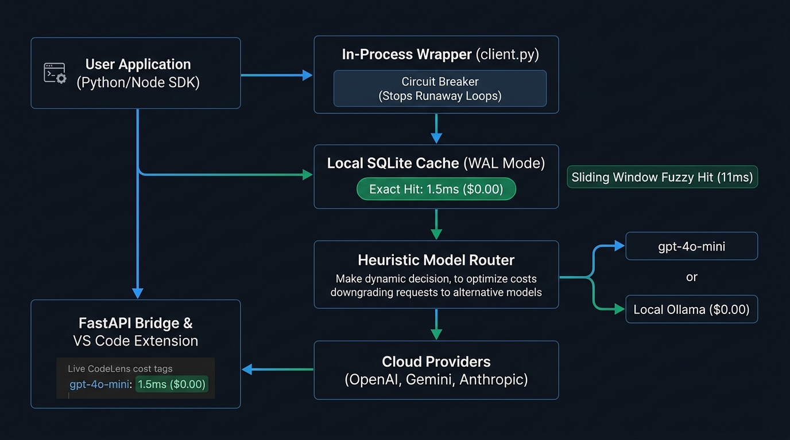
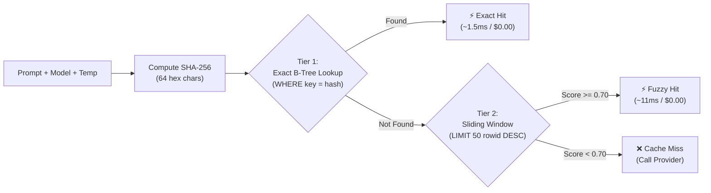
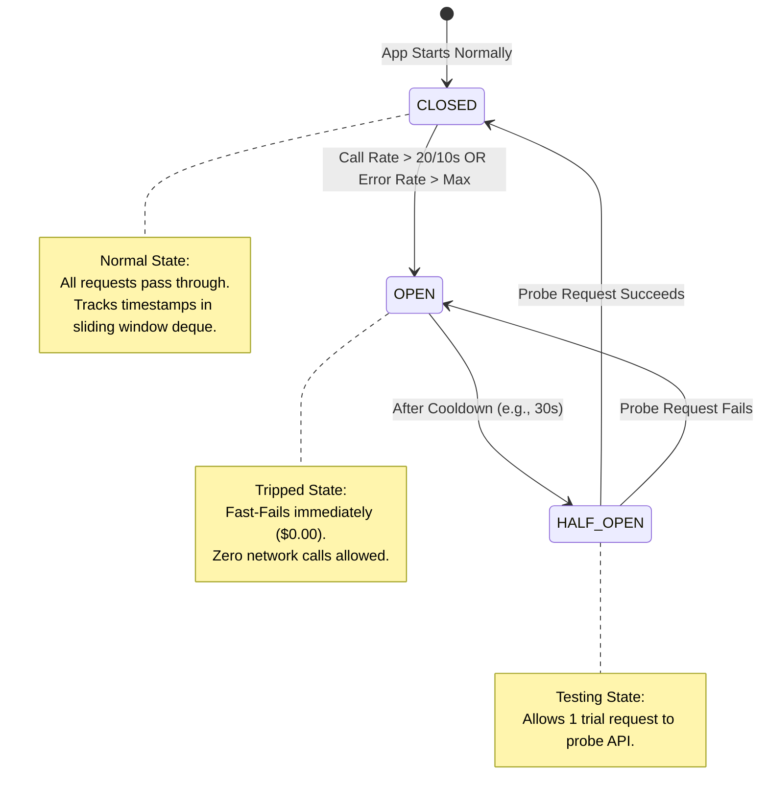

# CostOpt: Complete Architecture & Engineering Masterclass

---

## 1. The Core Mental Model (What is CostOpt in 1 Sentence?)

> **CostOpt is a local-first, in-process FinOps proxy and VS Code extension that intercepts LLM calls to eliminate redundant spend via sub-2ms caching, stop runaway agent billing loops via circuit breakers, and display live cost metrics directly inside the code editor.**

### The 3 Real-World Problems It Solves:
1. **Wasted Test Budget:** Developers run automated tests and prompts repeatedly during dev. A 100-test suite calling `gpt-4o` wastes money and takes 60+ seconds of network latency for unchanged prompts.
2. **Runaway Loops / Autonomous Agent Crashes:** An infinite `while` loop, bad retry logic, or an autonomous agent can fire 500 requests in 2 minutes, draining credit cards.
3. **Invisible Cost:** Developers have no idea how much money their code is burning until the end-of-month cloud bill arrives.

---

## 2. Complete End-to-End Architecture Diagram

<p align="center">
  
</p>

---

## 3. The Step-by-Step Request Lifecycle

When a developer runs `client.chat.completions.create(model="gpt-4o", messages=[...])`, here is exactly what happens in chronological order:

### Step 1: SDK Interception (Zero Network Calls Yet)
- The CostOpt wrapper intercepts the call before it touches the internet.
- It inspects the prompt text, model name, and parameters.

### Step 2: Circuit Breaker Inspection
- CostOpt checks its in-memory rolling time window.
- **Scenario A (Runaway detected):** If the application fired 25 calls in the last 10 seconds (exceeding threshold), the circuit breaker **trips immediately** to `OPEN` and raises `CostOptCircuitBreakerError`. Zero network requests are made.
- **Scenario B (Normal rate):** The request passes to the caching layer.

### Step 3: Hierarchical Caching (Tier 1 & Tier 2)
- **Tier 1 (Exact Match):** Computes `SHA-256(model + prompt + temperature)`. Looks up the 64-character hash key in SQLite (`cache.db`).
  - *If Found:* Returns cached JSON response in **~1.5 milliseconds** for **$0.00**.
- **Tier 2 (Fuzzy Match):** If exact lookup misses and `similarity_threshold < 1.0`, it loads the **50 most recently inserted queries** (`ORDER BY rowid DESC LIMIT 50`) and calculates Token Jaccard + TF-IDF similarity.
  - *If Similarity $\ge 0.70$:* Returns near-duplicate response in **~11 milliseconds** for **$0.00**.

### Step 4: Model Routing & Downgrade
- If complete cache miss: The Heuristic Router analyzes prompt intent across 7 categories (classification, extraction, summarization, etc.).
- If the task is simple (e.g. short JSON extraction), it can dynamically downgrade `gpt-4o` $\rightarrow$ `gpt-4o-mini` (saving ~80% cost).
- If the primary cloud API fails (timeout/500), the Fallback Manager automatically routes to secondary provider (Gemini or local Ollama).

### Step 5: Provider Execution & Token Pricing Calculation
- The request reaches the provider (OpenAI / Gemini / Ollama).
- Upon receiving the raw response, CostOpt extracts `prompt_tokens` and `completion_tokens`.
- It multiplies tokens by current rates from `pricing/providers/*.yaml` to compute the exact USD spend.

### Step 6: Background Telemetry & IDE Sync
- Saves new prompt + response into `cache.db`.
- Writes trace record (timestamp, cost, latency, feature tag) into `telemetry.db`.
- The local FastAPI server (`127.0.0.1:8400`) reads `telemetry.db` in WAL mode and pushes live metrics to the **VS Code CodeLens** extension above the developer's code.

---

## 4. Deep Dive into Every Subsystem

---

### Subsystem A: The In-Process SDK Wrapper (`src/costopt/client.py`)

* **Pattern:** Proxy / Decorator Pattern using Python's `__getattr__`.
* **How it works:**
  ```python
  class CostOpt:
      def __init__(self, raw_client, ...):
          self._client = raw_client
          self.chat = CostOptChat(self)

      def __getattr__(self, name):
          # Anything we don't explicitly intercept (e.g. client.models.list),
          # passes straight through to the underlying raw client!
          return getattr(self._client, name)
  ```
* **Why this design:** 
  - 100% backward compatible.
  - Preserves IDE autocompletion, type hints, and streaming async generators.
  - **Fail-Open:** If CostOpt's internal code ever has a bug, it logs a warning and executes the original API call so user code never crashes.

---

### Subsystem B: The Multi-Tier Caching Engine (`src/costopt/cache.py`)



#### Why SHA-256 for Exact Matches?
1. **$O(1)$ Fixed Key Size:** Prompts can be 10,000 characters long. Indexing huge strings bloats SQLite B-Trees. A SHA-256 hash is always exactly 64 characters.
2. **Zero Collision Risk:** $2^{256}$ keyspace eliminates any risk of two different prompts returning the same cached answer.
3. **Cross-Process & Cross-Language Determinism:** Unlike Python's `hash()` (which randomizes on restart), SHA-256 produces the identical string across Python, Node.js, and restarts.

#### Why the Bounded Sliding Window (`ORDER BY rowid DESC LIMIT 50`) for Fuzzy Matches?
* **The $O(N)$ Problem:** If you have 50,000 rows in SQLite, comparing text similarity against all 50,000 rows takes seconds.
* **The Solution:** Scan only the 50 most recent rows.
* **Why `rowid` over `created_at`:** In automated batch test loops, 100 queries might be inserted in the exact same epoch second. SQLite `rowid` is an auto-incrementing 64-bit integer, guaranteeing exact monotonic insertion order.
* **Result:** Lookup latency is **capped at ~10–12ms forever**, regardless of whether the database has 500 rows or 500,000 rows.

---

### Subsystem C: Sliding-Window Circuit Breaker (`src/costopt/circuit_breaker.py`)



* **Why Rolling Sliding Window vs Fixed Bucket?**
  - A fixed 1-minute bucket (e.g. reset at 00s) has an **edge burst flaw**: 20 requests at 00:59 and 20 requests at 01:01 pass a "20 req/min" limit despite firing 40 requests in 2 seconds.
  - CostOpt uses a monotonic timestamp queue that continuously purges timestamps older than `window_seconds`, preventing boundary bursts.

---

### Subsystem D: Heuristic Model Router (`src/costopt/router.py`)

* **Goal:** Intelligently downgrade simple tasks from expensive models (`gpt-4o` at \$2.50/M tokens) to cheaper models (`gpt-4o-mini` at \$0.15/M tokens) to cut spend by 60%–90%.
* **How it classifies (7 Intent Categories):**
  1. `classification`: Contains keywords like *"classify", "categorize", "is this sentiment"*
  2. `extraction`: Contains *"extract json", "parse entities", "regex"*
  3. `summarization`: Short prompts starting with *"summarize", "tl;dr"*
  4. `code_generation`: Contains code blocks, function signatures, syntax
  5. `reasoning`: Contains multi-step logic, math, *"think step by step"*
  6. `creative_writing`: *"write a story, poem"*
  7. `general_qa`: Default general questions
* **Why Heuristics over an LLM Router?**
  - An LLM router (calling a small model to decide which model to call) adds 300ms latency and costs extra tokens.
  - Regex & keyword density runs in **$<0.5\text{ms}$** at **$\$0.00$** cost.

---

### Subsystem E: Real-Time Telemetry & VS Code Extension

1. **FastAPI Bridge Server (`src/costopt/api/server.py`):**
   - Runs locally at `127.0.0.1:8400`.
   - Exposes clean REST endpoints: `/api/overview`, `/api/traces`, `/api/cache/stats`.
2. **VS Code Extension (`vscode-extension/src/`):**
   - **CodeLens Provider:** Scans the active editor AST for `client.chat.completions.create` and renders live inline spend indicators above the function line.
   - **Hover Provider:** Hovering over model names displays cost-per-1K-tokens and cache hit rates.
   - **Status Bar:** Shows cumulative session cost in the bottom tray.

---

## 5. Tech Stack Breakdown: Why Each Was Chosen & Alternatives

| Component | Technology Used | Key Alternative | Why We Picked Our Stack |
| :--- | :--- | :--- | :--- |
| **Integration** | In-Process Client Wrapper | Reverse HTTP Proxy (LiteLLM) | No port conflicts (`localhost:8000`), no background proxy daemon, native SDK typings/streaming preserved. |
| **Database** | SQLite (WAL Mode) | Redis / PostgreSQL | **Zero setup friction** (`pip install costopt`). No Docker needed. Sub-2ms local NVMe lookups. |
| **Cache Key** | SHA-256 Digest | Python `hash()` / Raw String | Raw string bloats B-Trees. Python's `hash()` is randomized on process restart. SHA-256 is deterministic and collision-free. |
| **Fuzzy Search** | Sliding Window (LIMIT 50) + TF-IDF | Vector DB (Pinecone / Chroma) | Vector DBs require 500MB PyTorch embedding dependencies and 50ms CPU latency. Sliding-window TF-IDF gives ~11ms predictable lookup. |
| **Router** | Heuristic Regex & Rules | LLM-based Router Model | Zero added token cost, $<0.5\text{ms}$ latency vs 300ms+ for LLM-based routers. |
| **Telemetry API** | FastAPI (Async) | Flask / Django | Asynchronous non-blocking I/O so telemetry logging never blocks user application threads. Native Pydantic validation. |
| **IDE Extension** | TypeScript (VS Code API) | Desktop GUI (Electron) | Developers want cost numbers directly inside their code editor (CodeLens), not in an external app window. |

---

## 6. How to Explain SQLite WAL Mode in 30 Seconds

If an interviewer asks: *"Why SQLite? Won't it lock when multiple threads write to it?"*

> *"By default, SQLite uses a rollback journal that locks the entire database during writes. In CostOpt, I configured SQLite in **WAL (Write-Ahead Logging) mode** with `PRAGMA journal_mode=WAL;` and `PRAGMA synchronous=NORMAL;`.*
>
> *In WAL mode, changes are written to a separate append-only `.db-wal` file. This means **readers never block writers, and writers never block readers**. The background application worker can write telemetry records while the FastAPI server and VS Code extension read statistics simultaneously with zero lock contention."*

---

## 7. The 2-Minute Interview Storyline (Memorize this flow!)

When they say: *"Tell me about CostOpt"* or *"Explain the architecture of your project"*:

1. **The Hook (Problem):** *"I built CostOpt because developers building with LLMs waste significant budget on repeated prompts during testing, and risk huge cloud bills from runaway recursive loops."*
2. **The Integration (Wrapper):** *"I designed it as a 1-line in-process SDK wrapper around OpenAI and Gemini. It intercepts calls before they hit the network."*
3. **The Core Pipeline (Safety & Speed):** *"First, a sliding-window circuit breaker checks call frequency to kill runaway loops. Next, a two-tier SQLite cache checks for exact SHA-256 matches (returning in 1.5ms for $0.00) or sliding-window fuzzy matches (~11ms)."*
4. **The Routing & Observability (Impact):** *"On cache misses, a heuristic router downgrades simple tasks to lighter models, calculates USD spend via YAML pricing tables, and streams telemetry to an interactive VS Code CodeLens extension. It's open-source on PyPI and VS Code with over 4,000 installs."*
